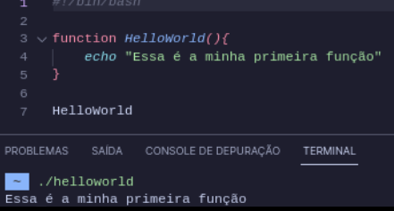
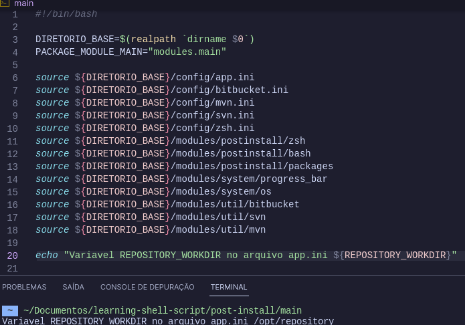
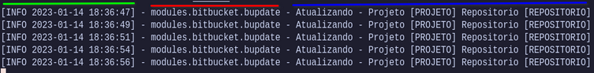

# Ubuntu - Automatize a configuração Pós Formatação

*******
## **ÍNDICE**

- [Motivacao](#motivação-e-agradrecimentos) <br>
  - [Por Onde Começar?](#por-onde-começar) <br>
  - [Shebang #!](#shebang) <br>
  - [Como Organizar meu Post Install?](#como-organizar-meu-post-install) <br>
  - [Funções](#funções) <br>
  - [Dotfiles](#dotfiles) <br>
  - [Modularize com o Source!](#modularize-com-o-source) <br>
  - [E o Output?](#e-o-output) <br>
- [Inicio](#inicio) <br>
  - [Configurações](#configurações) <br>
    - [app.ini](#appini) <br>
    - [bashrc.ini](#bashrcini) <br>
    - [bitbucket.ini](#bitbucketini) <br>
    - [mvn.ini](#mvnini) <br>
    - [zsh.ini](#zshini) <br>
  - [Estrutura de Diretórios](#estrutura-de-diretórios) <br>
  - [Explicando o funcionamento](#explicando-o-funcionamento) <br>
- [Como usar?](#como-usar) <br>
- [Guia avançado](#guia-avançado) <br>
  
*******
##  Motivação, e agradrecimentos 

Antes de chegar até aqui, tive vários motivadores, o primeiro e fundamental ter pegado gosto em aprender automações ser curioso, comecei com shell script, brincando em horas vagas ou montando scripts de relatórios.

Com base nesse aprendizado, fui vendo cenários e as vezes me perguntando será que dá para fazer isso? ou aquilo? 

Via muitos repositórios no github ou até mesmo no youtube automações fodásticas e me perguntava será que um dia chegarei nesse nível?

Acho que aos poucos cheguei a um nível de conhecimento que sinto orgulho de mim mesmo, mas lógico não sou detentor da verdade e com certeza meu código deve precisar de muitas melhorias.

Quando comecei a utilizar Linux no meu notebook empresarial, me perguntava se dava para automatizar as configurações, então encontrei esse video do maravilhoso [Mario Souto](https://twitter.com/omariosouto), [O que é dotfiles?](https://www.youtube.com/watch?v=Ficm64eRuVE) que fala exatamente por onde devo começar, via muitos dotfiles no github e queria algo que poderia ser mais "facil" para as pessoas poderem utilizar editar da forma que precisa, obiviamente a construção de um dotfiles é algo pessoal, cada pessoa tem seu jeito sua utilidade e pensei deixar o mais automatizado possível.

Esse gosto de querer compartilhar com a comunidade o conhecimento, fui aprendendo aos poucos acompanhando a comunidade [LinuxTips](https://www.linuxtips.io/) em conjunto com as lives do [Jeferson Fernando](https://twitter.com/badtux_), de forma timida, consegui aos poucos evoluir interagir mais com as pessoas, dai surgiu meu primeiro "filho", o [guiadevopsbrasil](https://github.com/waltenne/guiadevopsbrasil), que foi fazer um copiladão de conteudo gratuito para quem quer começar no mundo devops, e se perde em tantas sopas de letrinhas...

Ai chegando até hoje, eu queria compartilhar conhecimento e não sabia o que, ficava isso matutando, perdido, até que em um batepapo com o [André Brandão](https://twitter.com/absbrandao), me deu um grande empurrãozinho para iniciar algo, e resolvi compartilhar esse pequeno conhecimento que tenho.

Mas falando sério, você veio até aqui nesse repositório para ver o que eu inventei, em vez de ficar lendo texto de agradecimentos...

**Então vamos lá!**

O intuito dessa automação é realizar a pré configuração do Sistema Operacional, com base no meu uso diário.

Todo o Script foi modularizado pensando na organização e facilidade de manutenção.

*******
###  Por onde começar?

Para construir sua automação **post-install**, precisamos saber de algumas informações, elas são com base no seu uso diário.

- Lista de Pacotes a serem instalados
- Os pacotes serão instalados via apt ou via snap ou via .deb??
- Preciso automatizar a atualização do meu SO?
- Terei repositórios do tipo Git?
- Como irei restaurar a configuração dos meu programas e conexão ssh?


*******
###  Shebang

Manda instruções ao Kernel informando qual interpretador o mesmo irá chamar durante a execução do seu arquivo.

```
    #!/bin/bash 
    |     |
    |     |> Interpretador
    |> Shebang
```


*******
### Como organizar meu Post Install?

- Use e abuse do uso de funções para particionar seu script de acordo com a ação realizada.
- Tanto as variáveis quanto as funções precisam ter nomes de fácil entendimento.
- Documente seu código
- Use indentação
- Use dotfiles


*******
### Funções

É nada mais que um trecho do código que realiza uma tarefa específica, podendo ser chamada em qualquer parte do seu programa / script

- Mantendo clareza do código
- Tem-se independencia do restante do código
- Pode ser chamado várias vezes, podendo-se "ganhar" algumas linhas de código.




*******
### Dotfiles

Veio para organizar seus arquivos de configuração ou scripts em um único lugar e utilizando links simbólicos manteremos a estrutura do Sistema Operacional.


- .gitconfig
- .bash
- .bashrc
- .profile
- .m2
- .zsh

Se você ainda não assistiu o video que indiquei no começo dessa documentação, assista por favor:

:video_camera: [O que é dotfiles?](https://www.youtube.com/watch?v=Ficm64eRuVE)

É um video maravilhoso <3


*******
### Modularize com o Source

Comando utilizado para ler e executar comandos de outros arquivos shell.

- .gitconfig
- .bash
- .bashrc
- .profile
- .m2
- .zsh




*******
### E o Output?

Pensando em uma melhor experiência de uso, tentei o máximo possível deixar o output de execução, o mais clean possível, então minha ideia foi ter algo parecido que temos em aplicações modernas por exemplo logs springboot, ficando estruturado em três blocos.

1. <span style="color: green">Bloco em verde</span> é mostrado o Loglevel **(INFO/WARN/ERROR)** e a **Data/Hora da Execução**

2. <span style="color: red">Bloco em vermelho</span> é mostrado qual é o módulo que está executando estruturado em **modules.{nome_modulo}.{nome_funcao}**

1. <span style="color: blue">Bloco em azul</span> é mostrado a mensagem da execução, basicamente o que está sendo feito naquele momento




*******
# Inicio

Atualmente o Script foi pensado para ter as seguintes funções

1. **PostInstall**, servirá para instalar os pacotes necessários para uso do Sistema Operacional.

    - **packages** - Instalação dos Pacotes do SO.
   - **zsh** - Configuração do zsh.
   - **bashrc** - Configuração do bashrc.

2. **System**, servirá para utilitários do sistema

    - **os** - Atualização do SO.
    - **progress_bar** - Barra de Progresso, utilizado no módulo packages.

3. **Util**, servirá para utilitários do sistema

    - **bitbucket** - Responsável por realizar o Clone e Atualização Repositorios Bitbucket.
    - **mvn** - Responsável por realizar o Build dos projetos.

*******
# Configurações

Na pasta config, existe os seguintes arquivos de configuração.

*******
## **app.ini** 

```
REPOSITORY_WORKDIR - Diretorio para onde será realizado clone dos repositórios
```

Por exemplo **REPOSITORY_WORKDIR=/opt/repository**, ao realizar o clone dos repositórios os repositórios serão organizados dentro dessa pasta

### **bashrc.ini** 

```
BASHRC_ALIAS=() - Array para que você possa colocar os alias que 
serão cadastradosno bashrc
```
Por exemplo

```
BASHRC_ALIAS=(
	"alias dps='sudo docker ps'"
)
```

Quando for configurado o bashrc, será adicionado o alias dps para o comando **sudo docker ps**, então seguindo a configuração default, de exemplo que eu já deixo no arquivo, você pode ir adicionando ou removendo os comandos de acordo com a sua necessidade.

### **bitbucket.ini** 


```
WORKSPACE=  - Nome do workspace no Bitbucket
PROJECTS=() - Array com o nome do projeto/repositorio no Bitbucket.
```

Na estrutura do bitbucket você cria projetos e nele você cria repositorios, é como se tivesse um diretorio root que é o workspace e a divisão de pastas por projetos, por exemplo

```
WORKSPACE=linuxtips
PROJECTS=(
  "cloud/descomplicandoaws"
  "so/descomplicandolinux"
  "devops/descomplicandojenkins"
)

Com base no REPOSITORY_WORKDIR, definido no app.ini, 
o fluxo irá criar os repositorios organizando pelos projetos, 
ficando algo parecido com isso

/opt/repository/cloud/descomplicandoaws
-------------   ----  ----------------
   |             |       |
   |             |       |-> Repositório descomplicandoaws
   |             |
   |             |-> projeto cloud
   |
   |-> REPOSITORY_WORKDIR diretorio root /opt/repository
```

Após entender o funcionamento, você precisa configurar sua chave ssh para poder realizar o clone do repositório no github clique **[aqui](https://armitageweb.com.br/blog/como-configurar-acesso-ssh-para-o-git-no-bitbucket-linux)**, para poder configurar.

### **mvn.ini** 

```
MVN_PROJECTS=() - Array com o nome do projeto/repositorio do Bitbucket, 
que você deseja realizar os builds locais utilizando o comando mvn

MVN_NODE_PROJECT - Nome do projeto/repositorio do Bitbucket,
que você deseja realizar o build local utilizando o comando npm

A estrutura desse cara, pode ser baseada no bitbucket.ini com as mesma lógica, 
mas ela se torna diferente, pois aqui você vai preencher apenas com os dados 
dos repositórios que você deseja realizar o build da aplicação, utilizando o maven e o npm.

```

Após entender o funcionamento, você precisa o **settings.xml** dentro da .m2, normalmente caso for utilizar esse script base aonde trabalha, normalmente a equipe disponibiliza um arquivo template para que seja utilizado.

[Maven Settings](https://www.baeldung.com/maven-settings-xml)

[Settings Reference](https://maven.apache.org/settings.html)

### **zsh.ini**

```
ZSHRC_ALIAS=() - Array para que você possa colocar os alias
que serão cadastrados no zshrc
```
Por exemplo

```
ZSHRC_ALIAS=(
	"alias dps='sudo docker ps'"
)
```

Quando for configurado o zshrc, será adicionado o alias dps para o comando **sudo docker ps**, então seguindo a configuração default, de exemplo que eu já deixo no arquivo, você pode ir adicionando ou removendo os comandos de acordo com a sua necessidade.

*******
## Estrutura de diretórios

Esse projeto foi estruturado da seguinte forma


*******
### Visão geral

```
./config/    - Diretório dos arquivos de configuração
./dotfiles/  - Diretório Root do dotfiles
./modules/   - Diretório Root dos modulos.

```

*******
### dotfiles

```
./dotfiles/.aws/ - Diretório dos arquivos de configuração para o awscli.
./dotfiles/.local/share/remmina - Diretório dos arquivos de configuração remmina.
./dotfiles/.local/share/DBeaverData - Diretório dos arquivos de configuração  DBeaver.
./dotfiles/.ssh/ - Diretório dos arquivos de configuração ssh.
./dotfiles/.vscode/ - Diretório dos arquivos de configuração do vscode.
./dotfiles/bin/app - Diretório de binários de aplicativos.
./dotfiles/bin/script - Diretório de binários dos scripts.
```

*******
### modules

```
./modules/postinstall/ - Diretório dos scripts do modulo postinstall.
./modules/system/ - Diretório dos scripts do modulo system.
./modules/util/ - Diretório dos scripts do modulo util.
```

*******
## Explicando o funcionamento

Para facilitar toda a explicação, nos binários dos módulos deixei um comentário explicando a lógica usada.


*******
# Como usar?

Antes de executar o script post-instal, revise na documentação o indice [Configurações](#configurações), entenda um pouco seu funcionamento, para saber o que será executado em sua máquina.

Com os arquivos do projeto em um diretório, dê permissão de execução no binário principal

```bash
chmod +x main
```

Dê permissão de execução nos demais módulos com a função permissions

```bash
./main -permissions
```

Feito isso, agora você pode executar o post-install

```bash
./main -pinstall
```